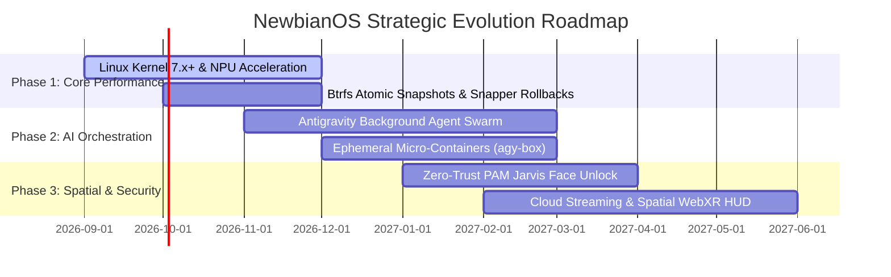

# NewbianOS Strategic Technical Proposals & Roadmap

```
   ___          __  _                         _  __           
  / _ | ___  __/ /_(_)__ ________ __  _____ _(_) /___ __ _____
 / __ |/ _ \/ _  / / _  / __/ _  /\ \/ / _  / / __/ // // _ \
/_/ |_/_//_/\_,_/_/\_, /_/  \_,_/  \_/ \_,_/_/\__/\_, // .__/
                  /___/                           /__//_/    
  ⚡ Architectural Proposals for Next-Generation AI-Native Computing
```

This document outlines high-impact technical proposals and strategic development tracks for **NewbianOS 13+**. These proposals aim to advance NewbianOS from a developer-ready Linux distribution into an industry-leading, AI-first operating system ecosystem.

---

## 📋 Proposals Overview Matrix

| # | Proposal Title | Impact | Effort | Target Phase |
|---|---|---|---|---|
| **1** | **Jarvis NPU & Local Neural Hardware Acceleration** | High | Medium | Phase 1 |
| **2** | **Immutable Atomic Core & Instant Btrfs Rollbacks** | High | Medium | Phase 1 |
| **3** | **Antigravity Swarm & Autonomous Background Agents** | High | High | Phase 2 |
| **4** | **Cloud Workstation Streaming & Spatial Holographic HUD**| High | High | Phase 2 |
| **5** | **Ephemeral Micro-Container Dev Environments (`agy-box`)** | Medium | Medium | Phase 2 |
| **6** | **Zero-Trust Hardware Enclave & Jarvis Face Unlock** | High | Medium | Phase 3 |
| **7** | **Spatial Audio Routing & Voice-Driven Terminal Gestures** | Medium | Low | Phase 3 |

---

## 🔮 Detailed Proposals

### Proposal 1: Jarvis NPU & Local Neural Hardware Acceleration
> **Goal**: Achieve sub-10ms latency for voice, vision, and code assistance by executing local models directly on dedicated Neural Processing Units (NPUs).

#### Technical Architecture:
- **Hardware Abstraction Layer**: Support for Intel NPU (OpenVINO), AMD Ryzen AI (XDNA), NVIDIA TensorRT-LLM, and Qualcomm Hexagon.
- **Model Quantization**: Deploy 4-bit and 8-bit quantized models (`GGUF`, `ONNX-GenAI`, `AWQ`) for Whisper STT, Piper TTS, and local reasoning LLMs.
- **Power Efficiency**: Offload continuous hotword listening and optical gaze tracking to the ultra-low-power NPU, preserving laptop battery life during pairing sessions.

---

### Proposal 2: Immutable Atomic Core & Instant Btrfs Rollbacks
> **Goal**: Eliminate the possibility of a broken system update while allowing developers full freedom to install arbitrary packages.

#### Technical Architecture:
- **Transactional Updates**: Adopt `systemd-sysext` and read-only base image layers (`/usr` mounted read-only via dm-verity or Btrfs subvolume snapshots).
- **Automated Pre-Update Snapshots**: Utilize `snapper` with GRUB integration so that any failed kernel or driver upgrade can be reverted in 2 seconds from the boot menu.
- **User Layer Separation**: Isolate all user customizations, Docker containers, and SDKs strictly in `/home` and `/var`.

---

### Proposal 3: Antigravity Swarm & Autonomous Background Agents
> **Goal**: Turn the operating system itself into a collaborative multi-agent development environment.

#### Technical Architecture:
- **Local Semantic Code Graph**: Daemon indexing all active Git repositories on disk using a local vector store (`sqlite-vec` / `Chromadb`) for instant whole-codebase context.
- **Autonomous Agent Swarms**: Allow Antigravity-IDE and Jarvis to spawn background worker agents that run tests, audit security vulnerabilities, and prepare PRs while the developer focuses on primary tasks.
- **IPC Event Bus**: Standardize D-Bus events (`org.newbianos.AgentEvents`) so agents can interact with system notifications, KDE Plasma widgets, and the holographic HUD.

---

### Proposal 4: Cloud Workstation Streaming & Spatial Holographic HUD
> **Goal**: Run NewbianOS on powerful desktop/server hardware while streaming pixel-perfect, low-latency UI to thin clients, iPads, MacBooks, and VR/AR spatial headsets (e.g. Apple Vision Pro / Meta Quest).

#### Technical Architecture:
- **Hardware-Accelerated WebRTC / Sunshine Streamer**: Native Wayland direct scanout capturing 4K 120fps with AV1/HEVC hardware encoding.
- **Spatial Holographic HUD**: Project the Jarvis HUD in true 3D spatial space using WebXR / OpenXR, enabling floating terminal and IDE canvases in virtual space.

---

### Proposal 5: Ephemeral Micro-Container Dev Environments (`agy-box`)
> **Goal**: Allow developers to clone and run any project in completely isolated, disposable containers without polluting the host OS.

#### Technical Architecture:
- **Integration with Devcontainer Spec**: Direct CLI tool `agy up` that parses `.devcontainer.json` or Dockerfiles and provisions an isolated runtime with GUI/Wayland forwarding, GPU pass-through, and shared `~/GoogleDrive` mounts.
- **Zero-Configuration Network**: Automatic local DNS resolution (`*.dev.local`) with built-in SSL termination.

---

### Proposal 6: Zero-Trust Hardware Enclave & Jarvis Face Unlock
> **Goal**: Combine enterprise-grade hardware cryptography with frictionless biometric AI access.

#### Technical Architecture:
- **Jarvis PAM Biometric Module**: Custom Linux PAM module (`pam_jarvis_face.so`) integrating optical face tracking to unlock screens and authorize `sudo` commands instantly when the authorized developer is seated in front of the workstation.
- **TPM2 Full-Disk Encryption**: Automatic LUKS2 key unsealing via TPM2 chips with Secure Boot validation.
- **FIDO2 / WebAuthn Integration**: Seamless developer hardware security key integration for Git commit signing and cloud logins.

---

### Proposal 7: Spatial Audio Routing & Voice-Driven Terminal Gestures
> **Goal**: Elevate the auditory and multimodal terminal experience.

#### Technical Architecture:
- **PipeWire 3D Spatial Audio**: Position Jarvis voice synthesis in 3D binaural space relative to active window positions.
- **Voice Macro Engine**: Voice shortcuts for terminal tasks (e.g. *"Jarvis, rebase on main and force push"*, *"Jarvis, split terminal and tail docker logs"*).

---

## 🗓️ Recommended Implementation Roadmap



---

## 💬 Community & Stakeholder Feedback
To provide input on these proposals or suggest new initiatives, submit an issue or proposal RFC on the [NewbianOS Community Portal](https://newbianos.org/proposals).
